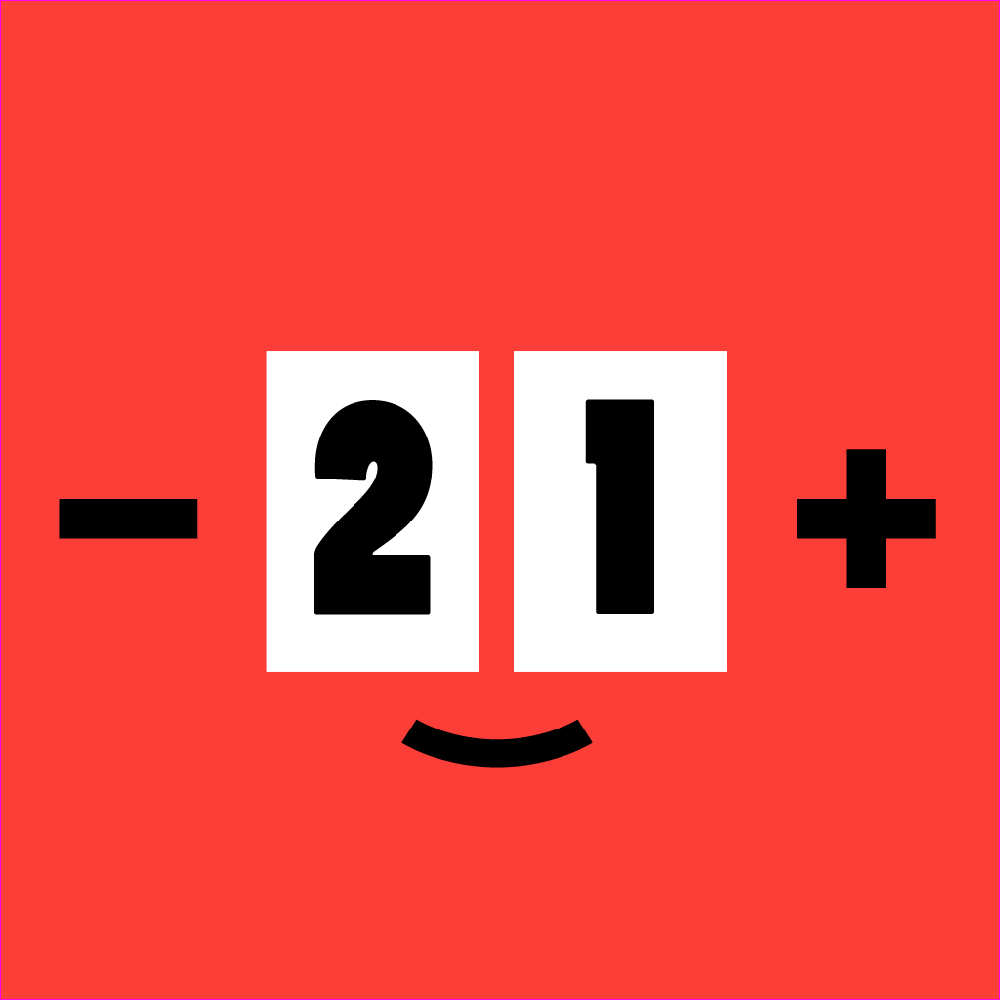

# 어쩜! 단수 카운터

📱 **플레이스토어** : https://play.google.com/store/apps/details?id=com.simpleknitcounter

📱 **원스토어** : https://onesto.re/0001001132

👾 **개발 기간** : 2025.04 ~

## 함께 만드는 사람들

<table border="1" cellpadding="5" cellspacing="0" style="border-collapse: collapse;">
<tr>
<td width="100" style="border-right: 1px solid #000; text-align: center;"><a href="https://github.com/icw0201">임채원</a></td>
<td rowspan="3" style="border-left: 1px solid #000;">제작하며 성장 중인 개발자 임채원입니다. 초기 계획보다 기능이 많아져서 디자인이 가장 큰 고민이었는데, 감사하게도 중간부터 디자이너분이 합류해주셨습니다. 앞으로도 뜨개인들이 필요한 기능 모두 담아낼 수 있도록, 간편함과 직관성도 잃지 않도록 힘써서 개발하겠습니다. 디자이너님과 파이팅! 
📧 <b>contact</b> : Gaebal0201@gmail.com</td>
</tr>
<tr>
<td width="100" style="border-right: 1px solid #000; text-align: center;"></td>
</tr>
<tr>
<td width="100" style="border-right: 1px solid #000; text-align: center;">이것저것 다 합니다</td>
</tr>
<tr>
<td width="100" style="border-right: 1px solid #000; text-align: center;"><a href="https://x.com/tu_mooner">뜨문어</a></td>
<td rowspan="3" style="border-left: 1px solid #000;">개발자님께 공예과는 시각디자인과와 다르다는 사실을 설득하는 데에 실패해서 잡혀왔습니다. 힘낼게요. 
📧 <b>contact</b> : schmucki@naver.com 
🕊️ **Twitter(X)**: <a href="https://x.com/tu_mooner">@Tu_mooner</a> </td>
</tr>
<tr>
<td width="100" style="border-right: 1px solid #000; text-align: center;"></td>
</tr>
<tr>
<td width="100" style="border-right: 1px solid #000; text-align: center;">디자이너</td>
</tr>
</table>

## 기술 스택
### FE

   

### DESIGN

## 서비스소개
**뜨개인을 위한 단수 카운터!** 카운터 기록과 프로젝트별 정보 관리 기능을 제공합니다.

🧶 뜨개인을 위한 간편하고 직관적인 단수 카운터
실물 카운터의 감각을 스마트하게 담았습니다.
프로젝트 단위로 여러 카운터를 추가하고, 터치 한 번으로 단수 카운트를 기록하세요!

📁 프로젝트 & 카운터 관리
여러 프로젝트를 생성하고, 각 프로젝트마다 여러 개의 카운터를 추가할 수 있어요.
- 프로젝트별 구분을 위한 하위 카운터 지원!
- 프로젝트/카운터별 편물 정보 저장 가능(날짜, 게이지, 실/바늘 정보 등)
- 보조 카운터를 더해 단 카운팅과 코 카운팅을 동시에!

👆 직관적인 조작 방식
- 배경을 터치해서 카운트 증감!
- 실물 카운터처럼 찰칵! 소리와 진동이 피드백을 줘요.
- 손에 편물이 들려 있어도 한 손으로도 조작 OK

👁️ 앞/뒷면(Way) 확인 기능
- 편물의 앞/뒤 상태를 전환하며 기록
- 자동 모드 사용 시, 카운트 변경에 따라 상태가 자동 전환

🎵 몰입을 돕는 사용자 환경
- 효과음 / 진동 설정 ON/OFF
- 화면 항상 켜짐 설정으로 번거로움 없이 실물 카운터처럼 사용 가능
- 팝업 창 형태로 뜨개 도안과 함께 활용 가능 (분할 화면 호환)

♻️ 기타 기능
- 데이터 초기화 기능 지원 – 프로젝트 정리 시 유용
- 앱 사용 중 광고 없음, 쾌적한 경험 제공

✨ 지금 바로 시작하세요
뜨개질을 사랑하는 누구나
쉽고 직관적인 단수 카운터 앱을 경험해보세요!

## 화면 구성

